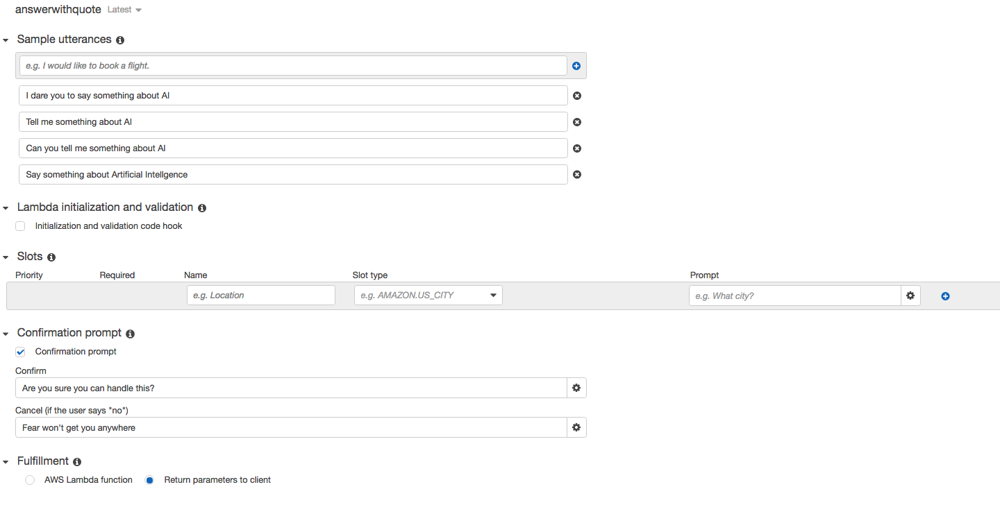
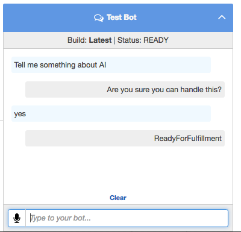
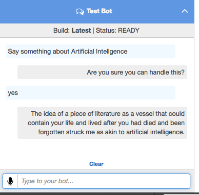

Lex is a service that is used for building conversational interfaces, like a chat bot on Facebook or a customer website, that uses voice(*) and text. Lex is the engine behind the Alexa personal assistant. Lex is able to provide speach and language recognition which enables us to create sophisticated and natual 'chatbots' to add to new or existing applications

In this example, we will be creating a simple Lex bot that uses a Lambda function to print out Artificial Intelligence quotes. The quotes will be read from a S3 bucket.


## Prepare IAM

 - Login to the AWS Console and go to the IAM console

 - Create a role called 'lambda-s3-lex'

 - In the policy section, attach 'AmazonS3ReadOnlyAccess' & 'AmazonLexRunBotsOnly' policies. For this example, we only these two roles. 

## Prepare S3

 - Create a bucket that will store the quotes file. You can name this bucket anything

 - Inside this bucket, there needs to be a file named 'quotes.txt'. You can use the s3/quotes.txt file provided in this repo.

 - In terms of S3 permissions, we are allowing any authenticated user to read objects in this bucket.

 - All other S3 settings can be left as default

## Update Python code

 - The code lambda\tell_me_about_ai.py has one variables that needs to be updated; S3_BUCKET. Update this with your bucket name

## Create Lex Bot and Intent

 - In the Lex console, choose custom bot

 - Use 'tellMeAboutAI' for the name

 - Pick any Output Voice

 - Set session timeout to 2 minutes

 - Use 'No' for the Child Directed question

 - Click create. This create the bot structure for our AI bot

 - Now, create an Intent with the name 'answerwithquote'

 - Fill out the fields as shown in the screenshot. This example is fairly simple but you can customise it if you want to experiment.
 


 - Now, click the "Build" button to build this. This usually takes about 5 to 10 seconds

 - Test the bot. This ensures our basic bot is working. We will come back to this after we finish configuring Lambda.
 
 

 

## Create Lambda Function

 - Now, go to the Lambda console, choose New Function, then Blank Function

 - Select Python 2.7 as your runtime

 - You can package and upload the Lambda code but for simplicity, just copy and paste the contents of tell_me_about_ai.py

 - In the function handler and role section, select the 'lambda-s3-lex' role created above.

 - Remaining options can be left as default

 - Choose create function

 - Once created, choose actions and 'configure test event'. Use the input below to test this function. This input provides the bot name and the intent name which are used in the Lambda code. If all else is fine, you should see "fulfillmentState": "Fulfilled" in the execution result
 
```
{
	"messageVersion": "1.0",
	"invocationSource": "lex",
	"userId": "sarahconner",
	"sessionAttributes": {},
	"bot": {
		"name": "tellMeAboutAI",
		"alias": "$LATEST",
		"version": "$LATEST"
	},
	"outputDialogMode": "Text",
	"currentIntent": {
	"name": "answerwithquote",
	"confirmationStatus": "None"
	}
}
```

## Configure Lex Bot with Lambda Function

 - Go back to the Lex console and choose the 'tellMeAboutAI' bot
 
 - Click on 'answerwithquote' intent and chose Latest in the version dropdown. Note, you can only edit the $LATEST version
 
 - Choose 'AWS Lambda Function' and select the 'tell_me_about_ai' function.
 
 - Save the intent
 
 - Choose build again
 
 - And run our test again. This time the output should be a quote that is returned by the Lambda function.
 
  

 
## Publish the bot

Finally, if you are happy with the build, and you want to make this live, press `Publish`. You will need to enter an alias for this to be referenced later on. To configure this with mobile applications, please refer to [http://docs.aws.amazon.com/lex/latest/dg/example2.html]()


# References

- [http://docs.aws.amazon.com/lex/latest/dg/what-is.html]()

- [https://aws.amazon.com/lex/faqs/]()

- [http://docs.aws.amazon.com/lex/latest/dg/API_Reference.html]()